# DB Schema Analysis — SU26SE039 Music Lounge Platform

> **Sinh bởi:** `/db-schema-analyst` skill  
> **Cập nhật lần 2:** 2026-07-01 (sau migrations LL1_MasterComplete + LL2_FixTicketPriceSpuriousFK)  
> **Phương pháp:** 6 pha theo SKILL.md — mọi quyết định có mã nguồn gốc  
> **DBMS mục tiêu:** SQL Server Developer Edition (local) / Azure SQL (prod)

---

## Pha 0 — Sổ nguồn (Source Registry)

| Ký hiệu | File | Nội dung |
|---|---|---|
| `SRC-01` | `docs/architecture/01-overview.md` | Tổng quan, tech stack, actors |
| `SRC-02` | `docs/architecture/02-database.md` | 54 bảng, 17 nhóm, conventions |
| `SRC-03` | `docs/business/03-business-requirements.md` | 33 BR trong 7 nhóm, 31 workflows |
| `SRC-04` | `docs/architecture/04-design-decisions.md` | 17 quyết định thiết kế đã chốt |
| `SRC-05` | `docs/business/06-compliance.md` | 5 Nghị định: NĐ 52, 117, 147, 85, BVDLCN 2025 |
| `SRC-06` | `docs/ops/07-project-status.md` | 6 pending items, Q&A đã chốt |
| `SRC-07` | `memory/complete_reference.md` | D1–D17 business logic chốt |
| `SRC-08` | Migrations `InitialCreate` → `LL2_FixTicketPriceSpuriousFK` | Trạng thái DB thực tế |
| `SRC-09` | `ApplicationDbContextModelSnapshot.cs` | 54 DbSet đã registered |
| `SRC-10` | Domain entities (53 files) + 54 EF Configurations | Code implementation |

**Trạng thái triển khai (post LL1 + LL2):**

| Chỉ số | Lần 1 (trước LL1) | Lần 2 (hiện tại) |
|---|---|---|
| Bảng thiết kế | 54 | 54 |
| Bảng đã migrate | 33 | 54 ✅ |
| Gap | 21 bảng ❌ | 0 bảng ✅ |
| BRs covered | 22/33 (67%) | 33/33 (100%) ✅ |
| Build errors | 7 | 0 ✅ |

---

## Pha 1 — Traceability Matrix

### 1.1 Nhóm BR → Entity (toàn bộ 33 BR)

| BR ID | Diễn giải | Entity chính | Constraint/Field chốt | Trạng thái |
|---|---|---|---|---|
| **BR-01** | Owner đăng ký venue, phải được Admin duyệt | `Lounges` | `status=pending/approved/...`, `business_license_url` | ✅ |
| **BR-02** | Venue phải có subscription để tạo event | `owner_subscriptions`, `subscription_packages` | `status`, `expires_at`, `max_tickets_per_event_snapshot` | ✅ LL1 |
| **BR-03** | Owner quản lý ảnh, seating zones của venue | `lounge_images`, `seating_zones` | `is_primary` partial UNIQUE, `capacity`, `is_active` | ✅ LL1 |
| **BR-04** | Owner tạo event, nộp AI moderation | `LoungeShows`, `event_moderations` | `status=draft/published`, AI score fields | ✅ |
| **BR-05** | Owner assign Staff cho venue | `lounge_staff` | `lounge_id`, `user_id`, `is_active`, `assigned_by` — RESTRICT delete | ✅ LL1 |
| **BR-06** | Event có lineup nghệ sĩ | `Performances`, `Performers` | `accepts_donation`, `created_by_user_id` | ✅ |
| **BR-07** | Event có nhiều ticket tier (vật lý/livestream) | `TicketTiers` | `access_type`, `zone_id` FK → `seating_zones` | ✅ |
| **BR-08** | Mỗi tier có nhiều đợt giá | `TicketPrices` | `price`, `quota`, `sale_start`, `sale_end`, `purchase_channel` | ✅ |
| **BR-09** | Event online bắt buộc có livestream | `livestreams` | `is_free`, `chat_enabled`, CF Stream fields | ✅ |
| **BR-10** | Giá vé cả đêm, không check-in theo giờ | `physical_ticket_details` | `checked_in_at` — không có time window constraint | ✅ |
| **BR-11** | Walk-in khi show đang diễn | `TicketPrices` | `sale_end` nullable hoặc > `actual_start` | ✅ |
| **BR-12** | Giá theo khung giờ (optional) | `TicketPrices` | nhiều rows cùng tier, khác `sale_start/sale_end` | ✅ |
| **BR-13** | Audience mua vé online, thanh toán VNPay | `tickets`, `payments`, `ticket_holds` | `tickets.id = NEWSEQUENTIALID()`, `buyer_id` nullable | ✅ |
| **BR-14** | Anti-oversell: hold vé 15 phút | `ticket_holds` | `is_released`, `held_until` — system_config `ticket_hold_minutes` | ✅ |
| **BR-15** | Audience xem wishlist và follow venue | `Wishlists`, `Follows` | UNIQUE `(user_id, lounge_show_id)`, UNIQUE `(user_id, lounge_id)` | ✅ |
| **BR-16** | Livestream chat real-time (SignalR) | `livestream_chat_messages` | `content`, `is_deleted` | ✅ |
| **BR-17** | Staff check-in vé bằng QR | `physical_ticket_details` | `qr_code` UUID riêng, partial UNIQUE index | ✅ |
| **BR-18** | F&B ordering tại show | `fnb_menu_items`, `fnb_orders`, `fnb_order_items` | `unit_price` snapshot (D12), `total_amount` set by C# (§6.15) | ✅ LL1 |
| **BR-19** | Audience donate cho performer, 2 chặng | `donations` | `status`, `bank_account_snapshot`, `donor_user_id` ON DELETE SET NULL | ✅ |
| **BR-20** | Audience đánh giá sau show (7 ngày) | `Ratings`, `LoungeShows` | `rating_open_until`, UNIQUE `(user_id, show_id)` | ✅ |
| **BR-21** | Settlement 2 giai đoạn | `settlements` | `stage`, `gross_amount`, `net_amount`, `platform_fee_rate` snapshot | ✅ |
| **BR-22** | Sổ cái bất biến double-entry | `ledger_entries`, `ledger_accounts` | append-only, không có `updated_at` | ✅ |
| **BR-23** | Hoàn tiền cho event hủy/đổi giờ | `refund_requests` | `refund_percentage`, `amount_approved`, `status` | ✅ LL1 |
| **BR-24** | AI gợi ý sự kiện (Hybrid 3 thành phần) | `AiRecommendations`, `BehaviourLogs`, `user_event_scores` | `expires_at`, `algorithm`, composite PK `(user_id, show_id)` | ✅ |
| **BR-25** | AI consent BVDLCN 2025 | `Users` | `ai_consent = false` default | ✅ |
| **BR-26** | Kiểm duyệt nội dung, SLA 24h (NĐ 147) | `event_moderations` | `sla_deadline`, `ai_score`, `status` | ✅ |
| **BR-27** | Kênh khiếu nại (NĐ 85/2021) | `complaints` | `target_type/id`, `contact_phone` (guest), `category`, complainant ON DELETE SET NULL | ✅ LL1 |
| **BR-28** | Phạt venue: warning/suspension/ban | `venue_penalties` | `penalty_type`, `suspension_days`, `appeal_deadline`, `appeal_result` | ✅ LL1 |
| **BR-29** | Cấu hình hệ thống không hardcode | `system_config`, `system_config_history` | `config_key` UNIQUE AK, history append-only (bigint PK), FK via ConfigKey | ✅ LL1 |
| **BR-30** | Xác thực phone (NĐ 147/2024) | `Users` | `phone_verified BIT DEFAULT 0` | ✅ LL1 |
| **BR-31** | Thuế khấu trừ 5% (NĐ 117/2025) | `payments` | `tax_withheld` — tax account trong `ledger_accounts` | ✅ |
| **BR-32** | Thanh toán qua gateway licensed (NĐ 52/2024) | `payments` | `gateway_fee`, `gross_amount`, `net_amount` — `TransactionId` UNIQUE index (VNPay idempotency) | ✅ LL1 |
| **BR-33** | PII anonymization khi xóa tài khoản | 4 bảng | `tickets.buyer_id`, `donations.donor_user_id`, `Ratings.user_id`, `complaints.complainant_user_id` — tất cả ON DELETE SET NULL | ✅ |

### 1.2 Compliance Matrix

| Nghị định | Requirement | DB Implementation | Trạng thái |
|---|---|---|---|
| NĐ 52/2024 | Thanh toán qua VNPay licensed | `payments.gross_amount/net_amount/gateway_fee`; `TransactionId` UNIQUE (idempotency) | ✅ |
| NĐ 117/2025 | Thuế khấu trừ 5% | `payments.tax_withheld`; tax account type trong `ledger_accounts` | ✅ |
| NĐ 147/2024 | SLA 24h; xác thực phone | `event_moderations.sla_deadline`; `users.phone_verified` | ✅ LL1 |
| NĐ 85/2021 | Kênh khiếu nại bắt buộc | `complaints` table — guest (nullable complainant) + logged-in user | ✅ LL1 |
| BVDLCN 2025 | PII anonymization; AI consent opt-out | `ON DELETE SET NULL` (4 FKs); `users.ai_consent = false` default | ✅ |

---

## Pha 2 — User & Journey Mapping

| Actor | Hành động chính | Entity chạm tới | Tần suất | Ghi chú |
|---|---|---|---|---|
| **Guest** | Xem events, khiếu nại ẩn danh | `LoungeShows`, `complaints` (nullable complainant) | Cao, read-only | Không ghi dữ liệu event |
| **Audience** | Mua vé, donate, wishlist, đánh giá, follow | `tickets`, `ticket_holds`, `payments`, `donations`, `Wishlists`, `Follows`, `Ratings`, `BehaviourLogs` | Cao, mixed R/W | PII fields nullable khi xóa tài khoản |
| **Staff** | Check-in QR, phục vụ F&B | `physical_ticket_details`, `fnb_orders`, `lounge_staff` | Trung bình, burst khi show bắt đầu | FK `lounge_staff.user_id` verify đúng lounge |
| **Owner** | Tạo event, manage lineup, xác nhận donation, xem settlement | `LoungeShows`, `Performances`, `donations`, `settlements`, `owner_subscriptions`, `lounge_images` | Trung bình | Dashboard aggregation queries nặng |
| **Admin** | Duyệt venue, event moderation, phạt venue, config hệ thống | `event_moderations`, `venue_penalties`, `system_config`, `complaints` | Thấp nhưng critical | `system_config_history` audit trail cho mọi thay đổi |
| **Performer** | Data entity, không đăng nhập | `Performers`, `PerformerGenres`, `Performances`, `bank_accounts` (polymorphic) | Passive | `created_by_user_id` cho quyền edit (§6.12) |
| **VNPay** | Callback thanh toán | `payments`, `tickets`, `donations` | High, async | `TransactionId` UNIQUE index — idempotency ✅ |
| **Hangfire Jobs** | Giải phóng holds, trigger settlement, cảnh báo donation | `ticket_holds`, `settlements`, `notifications`, `venue_penalties` | Scheduled, low freq | Đọc `system_config` cho SLA thresholds |
| **SignalR Hub** | Broadcast chat, reactions, donate alert | `livestream_chat_messages` | Realtime, ephemeral | Reactions không ghi DB |
| **ML.NET Service** | Chấm điểm AI, cache recommendation | `AiRecommendations`, `BehaviourLogs`, `user_event_scores`, `custom_criteria` | Batch (6h TTL) | Chỉ chạy khi `ai_consent = true` |

---

## Pha 3 — Business Rules → DB Constraints

| BR-ID | Rule | Enforce tại |
|---|---|---|
| BR-13 | `tickets.id` = UUID non-guessable | `NEWSEQUENTIALID()` default ✅ |
| BR-14 | Hold timeout 15 phút | Hangfire + `ticket_holds.is_released` + `held_until` |
| BR-15 | Follow/Wishlist unique per user | UNIQUE constraint `(user_id, lounge_id)` / `(user_id, lounge_show_id)` ✅ |
| BR-17 | QR code resettable (tách biệt ticket.id) | `physical_ticket_details.qr_code` UUID riêng, partial UNIQUE |
| BR-20 | Rating 1 user 1 event | UNIQUE `(user_id, lounge_show_id)` với NULL policy (SQL Server allows multiple NULLs) ✅ |
| BR-22 | Ledger append-only | Không có `updated_at` trên `ledger_entries` — signal cho dev |
| BR-25 | AI opt-out default | `users.ai_consent BIT DEFAULT 0` ✅ |
| BR-32 | VNPay idempotency | `payments.TransactionId` UNIQUE partial index `WHERE TransactionId IS NOT NULL` ✅ |
| BR-33 | PII anonymize | `ON DELETE SET NULL` cho 4 FK — không xóa lịch sử tài chính ✅ |
| D1 | SeatingZone FK chỉ trên TicketTier | `ticket_tiers.zone_id` FK → `seating_zones`; `ticket_prices` KHÔNG có zone FK ✅ (fixed LL2) |
| Domain | 1 ảnh primary per lounge | Partial UNIQUE index `WHERE [IsPrimary] = 1` ✅ |
| Domain | Custom criteria unique per lounge | UNIQUE `(lounge_id, key)` ✅ |
| Domain | Event custom values unique | UNIQUE `(show_id, criteria_id)` ✅ |
| Domain | User preferences unique per criteria | UNIQUE `(user_id, criteria_id)` ✅ |
| Domain | `system_config.config_key` | Alternate Key (UNIQUE constraint `AK_system_config_ConfigKey`) — FK target cho `system_config_history` |

---

## Pha 4 — Schema Physical Review

### 4.1 Conceptual ERD (Core Flows — Mermaid)

```mermaid
erDiagram
    Users ||--o{ tickets : "buys"
    Users ||--o{ donations : "donates"
    Users ||--o{ Follows : "follows lounge"
    Users ||--o{ Wishlists : "wishlists show"
    Users ||--o{ Ratings : "rates show"
    Users ||--o{ BehaviourLogs : "tracked (consent)"
    Users ||--o{ lounge_staff : "assigned as staff"
    Users ||--o{ owner_subscriptions : "subscribes"
    Lounges ||--o{ LoungeShows : "hosts"
    Lounges ||--|| Users : "owned by"
    Lounges ||--o{ lounge_images : "has images"
    Lounges ||--o{ seating_zones : "has zones"
    Lounges ||--o{ fnb_menu_items : "has menu"
    LoungeShows ||--o{ TicketTiers : "has tiers"
    LoungeShows ||--o{ Performances : "lineup"
    LoungeShows ||--o{ event_moderations : "reviewed"
    LoungeShows ||--o{ AiRecommendations : "recommended"
    LoungeShows }o--|| event_categories : "categorized"
    TicketTiers }o--|| seating_zones : "zone"
    TicketTiers ||--o{ TicketPrices : "priced by"
    TicketPrices ||--o{ tickets : "generates"
    TicketPrices ||--o{ ticket_holds : "held"
    tickets ||--o| physical_ticket_details : "physical detail"
    tickets ||--o| livestream_ticket_details : "online detail"
    tickets ||--o| payments : "paid by"
    payments ||--o{ ledger_entries : "journals"
    payments ||--o{ settlements : "settled"
    payments ||--o{ refund_requests : "refunded"
    donations ||--o{ ledger_entries : "journals"
    Performers ||--o{ Performances : "performs"
    Performers ||--o{ bank_accounts : "receives donation (polymorphic)"
    Lounges ||--o{ bank_accounts : "receives settlement (polymorphic)"
    LoungeShows ||--o{ livestreams : "streamed via"
    livestreams ||--o{ livestream_chat_messages : "has chat"
    Users ||--o{ notifications : "notified"
    Users ||--o{ complaints : "files"
    Lounges ||--o{ venue_penalties : "penalized"
    Lounges ||--o{ custom_criteria : "defines criteria"
    custom_criteria ||--o{ event_custom_values : "evaluated per event"
    custom_criteria ||--o{ user_custom_preferences : "preferred per user"
    ledger_accounts ||--o{ ledger_entries : "debit/credit"
    subscription_packages ||--o{ owner_subscriptions : "subscribed"
    fnb_menu_items ||--o{ fnb_order_items : "ordered"
    fnb_orders ||--o{ fnb_order_items : "contains"
    Users ||--o{ user_event_scores : "scored"
    LoungeShows ||--o{ user_event_scores : "scored against"
    system_config ||--o{ system_config_history : "audits"
```

### 4.2 Mapping: 17 Nhóm → Bảng Thực Tế (post LL1 + LL2)

| Nhóm | Bảng thiết kế (SRC-02) | Bảng thực tế trong DB | Khác biệt |
|---|---|---|---|
| **N1** | `users`, `lounge_staff`, `bank_accounts` | `Users`, `lounge_staff`, `bank_accounts` | Naming mix (xem OQ-07) |
| **N2** | `music_genres`, `moods`, `venue_atmospheres` | `Genres`, `Moods`, `Atmospheres` | Naming mix |
| **N3** | `music_lounges`, `lounge_images`, `seating_areas`, `event_categories` | `Lounges`, `lounge_images`, `seating_zones`, `event_categories` | `seating_areas` → `seating_zones` (tên khác nhau) |
| **N4** | `subscription_packages`, `owner_subscriptions` | `subscription_packages`, `owner_subscriptions` | ✅ Khớp |
| **N5** | `performers`, `performer_genres`, `events`, `performance`, `livestreams`, `livestream_chat_messages`, ~~song_requests~~ | `Performers`, `PerformerGenres`, `LoungeShows`, `Performances`, `Livestreams`, `LivestreamChatMessages` | `events` → `LoungeShows`; `song_requests` đã xóa có chủ đích |
| **N6** | 6 junction tables | `LoungeShowGenres`, `LoungeShowMoods`, `LoungeShowAtmospheres`, `PerformerGenres`, `UserFavouriteGenres`, `UserFavouriteMoods`, `UserFavouriteAtmospheres` | ✅ Đủ |
| **N7** | `ticket_tiers`, `ticket_prices`, `tickets`, `physical_ticket_details`, `livestream_ticket_details` | ✅ Khớp | |
| **N8** | `ticket_holds` | `TicketHolds` | Naming |
| **N9** | `payments`, `donations`, `account`, `ledger_entry`, `settlement` | `payments`, `Donations`, `ledger_accounts`, `ledger_entries`, `Settlements` | `account` → `ledger_accounts` (tên rõ nghĩa hơn) |
| **N10** | `refund_requests` | `refund_requests` | ✅ |
| **N11** | `fnb_menu_items`, `fnb_orders`, `order_items` | `fnb_menu_items`, `fnb_orders`, `fnb_order_items` | `order_items` → `fnb_order_items` (prefix rõ hơn) |
| **N12** | `event_ratings`, `follows`, `event_wishlists`, `user_behaviour_log`, `user_event_scores` | `Ratings`, `Follows`, `Wishlists`, `BehaviourLogs`, `user_event_scores` | Naming mix |
| **N13** | `ai_recommendations` | `AiRecommendations` | Naming |
| **N14** | `notifications` | `notifications` | ✅ |
| **N15** | `event_moderations`, `complaints`, `venue_penalties` | `EventModerations`, `complaints`, `venue_penalties` | Mix |
| **N16** | `system_config` | `system_config`, `system_config_history` | +1 bảng audit log (tốt) |
| **N17** | `custom_criteria`, `event_custom_values`, `user_custom_preferences` | ✅ Khớp (snake_case) | |

**Tổng: 54 bảng core** (theo thiết kế) + 1 bảng audit (`system_config_history`) = **55 bảng vật lý** ✅

### 4.3 Bug phát hiện & xử lý trong lần analysis này

| Bug | Mô tả | Root cause | Fix |
|---|---|---|---|
| **BUG-LL2** | `TicketPrices.SeatingZoneId` cột spurious | `SeatingZone.ICollection<TicketPrice>` nav property → EF suy ra shadow FK | Xóa nav property khỏi `SeatingZone.cs` → migration `LL2_FixTicketPriceSpuriousFK` |
| **BUG-LL1-a** | `BehaviourAction.View` không tồn tại | Enum có `ViewEvent`, không phải `View` | `GetLoungeShowDetailQueryHandler.cs` fix |
| **BUG-LL1-b** | `BehaviourAction.Wishlist/Share` không tồn tại | Enum có `ViewAfterWishlist`, `ShareEvent` | `MLNetRecommendationService.cs` fix |
| **BUG-LL1-c** | `SettlementStatus.Pending/Processing/Completed` không tồn tại | Enum có `Scheduled/Released` | 3 files fix |

### 4.4 Câu hỏi 4 chiều cho bảng quan trọng

**`tickets`** — BR-13, BR-17, BR-33
- Actors: Audience (mua), Staff (check-in), Hangfire (cancel expired), VNPay callback (set PaymentId)
- PII: `buyer_id` ON DELETE SET NULL ✅; `PaymentId` ON DELETE SET NULL ✅
- Tăng trưởng: Trung bình. UUID PK: JOIN hơi nặng hơn INT nhưng bảo mật QR ưu tiên (RATIONALE-001)

**`ledger_entries`** — BR-22, NĐ 117
- Actors: VNPay callback (ghi), Settlement job (ghi), Auditor (đọc) — KHÔNG ai update/delete
- Nhạy cảm: Tài chính — audit trail bất biến
- Tăng trưởng: Nhanh (N dòng/giao dịch) — cân nhắc archiving sau 2 năm hoạt động

**`BehaviourLogs`** — BR-24, BR-25
- Actors: App (ghi khi consent=true), ML.NET batch (đọc)
- Nhạy cảm: Behavioral data (BVDLCN) — chỉ ghi khi `ai_consent = true`
- **Tăng trưởng nhanh nhất** — cần partitioning khi > 1M rows (future sprint)

**`system_config`** — BR-29, tất cả config
- Actors: Admin (update), tất cả services (đọc)
- Nhạy cảm: Không, nhưng thay đổi ảnh hưởng toàn hệ thống
- Cần seed data: 12 keys từ §6.7 phải được seeded vào migration hoặc startup

---

## Pha 5 — Design Rationale (ADR Format)

### RATIONALE-001: `tickets.id` = UUID NEWSEQUENTIALID() thay vì INT IDENTITY

**Ngữ cảnh:** BR-17 (Staff quét QR). QR encode ticket.id trực tiếp.

**Phương án đã cân nhắc:**
1. `INT IDENTITY` — simple, fast JOIN. Nhược: `id=123` → attacker đoán 122/124 → fake QR.
2. `UNIQUEIDENTIFIER NEWSEQUENTIALID()` — không đoán được, sequential = B-tree không bị fragment.

**Quyết định:** NEWSEQUENTIALID(). `qr_code` trên `physical_ticket_details` là UUID riêng (resettable nếu bị lộ).

**Trade-off:** JOIN nặng hơn (16 byte). Chấp nhận: security > performance cho vé.

**Source:** SRC-04 §6.1 · BR-13, BR-17

---

### RATIONALE-002: 3 tầng `ticket_tiers` → `ticket_prices` → `tickets`

**Ngữ cảnh:** BR-08 (giá theo khung giờ), BR-12 (walk-in), domain đặc thù phòng trà.

**Phương án đã cân nhắc:** Flat, 2 tầng, 3 tầng (hiện tại).

**Quyết định:** 3 tầng. Mỗi tầng có trách nhiệm rõ: tier = zone/type, price = đợt bán, ticket = vé thực.

**Trade-off:** `tickets` không có `event_id` trực tiếp — derive qua 2 JOIN. Có thể denorm sau khi profiling.

**Source:** SRC-04 §6.2 · BR-07, BR-08, BR-12

---

### RATIONALE-003: `ledger_entries` append-only, không có `updated_at`

**Ngữ cảnh:** BR-22, NĐ 117/2025.

**Quyết định:** Append-only. Sai → ghi reversal entry. Vắng `updated_at` = signal cho developer: đừng UPDATE.

**Source:** SRC-04 §6.4 · BR-22

---

### RATIONALE-004: Polymorphic `(owner_type, owner_id)` cho `bank_accounts`

**Ngữ cảnh:** Cả Venue và Performer đều có bank account.

**Quyết định:** 1 bảng polymorphic — nhất quán với `payments`, `ledger_accounts`, `event_moderations`, `complaints`.

**Trade-off:** App layer phải enforce referential integrity. Cần integration test.

**Source:** SRC-02 §Polymorphic References

---

### RATIONALE-005: ON DELETE SET NULL cho 4 PII FK

**Ngữ cảnh:** BVDLCN 2025 — xóa tài khoản phải anonymize, không xóa lịch sử tài chính.

**Quyết định:** `tickets.buyer_id`, `donations.donor_user_id`, `Ratings.user_id`, `complaints.complainant_user_id` — tất cả ON DELETE SET NULL.

**Trade-off:** Query lịch sử user phải filter `buyer_id IS NOT NULL`.

**Source:** SRC-05 BVDLCN 2025 · BR-33

---

### RATIONALE-006: `system_config` + `system_config_history` (2 bảng)

**Ngữ cảnh:** §6.7 — không hardcode tham số tài chính/compliance.

**Quyết định:** `system_config` (hiện tại) + `system_config_history` (append-only audit). FK via `ConfigKey` string (Alternate Key) thay vì INT PK — đảm bảo history luôn trỏ đúng key ngay cả khi row ID thay đổi.

**Source:** SRC-04 §6.7 · BR-29, NĐ 117, NĐ 147

---

### RATIONALE-007: VNPay idempotency — `payments.TransactionId` UNIQUE partial index

**Ngữ cảnh:** VNPay có thể retry callback nhiều lần. Trước LL1 không có field này → double-charge risk.

**Quyết định (LL1):** Thêm partial UNIQUE index `WHERE [TransactionId] IS NOT NULL` trên `payments.TransactionId`.

**Không thêm cột riêng** vì `TransactionId` đã là field có sẵn, chỉ thiếu UNIQUE constraint.

**Source:** SRC-05 NĐ 52/2024 · BR-32

---

### RATIONALE-008: `SeatingZone → TicketTier` (không phải `SeatingZone → TicketPrice`)

**Ngữ cảnh:** Design §6.2 — zone FK thuộc `ticket_tiers.zone_id`, không phải trên `ticket_prices`.

**Bug đã xảy ra:** `SeatingZone.ICollection<TicketPrice>` nav property → EF tự sinh `SeatingZoneId` FK shadow property trên `TicketPrices` → migration LL1 có cột spurious.

**Fix (LL2):** Xóa nav property. `TicketTierConfiguration` đã dùng `.WithMany()` (no collection on zone side) — đủ cho query.

**Bài học:** Với polymorphic/partial nav properties, luôn dùng `.WithMany()` không có argument để tránh EF suy ra sai chiều.

**Source:** SRC-04 §6.2 · D1

---

## Pha 6 — Quality Scorecard (Post LL1 + LL2)

| # | Đặc tính ISO 25010 | Đánh giá | Ghi chú |
|---|---|---|---|
| 1 | **Functional Suitability** | ✅ **Đạt** | 33/33 BRs covered. 5/5 Nghị định mapped. 0 missing tables. |
| 2 | **Performance Efficiency** | ⚠️ Rủi ro | Hot path indexes đầy đủ (ticket_holds, ratings, notifications). Rủi ro: `BehaviourLogs` tăng nhanh nhất — cần partitioning plan ở sprint 4+. `user_event_scores` composite PK tốt. |
| 3 | **Compatibility** | ✅ **Đạt** | VNPay: `TransactionId` UNIQUE idempotency ✅. DateTimeOffset timezone-aware. Phone E.164 compatible. |
| 4 | **Usability (dev/ops)** | ⚠️ Rủi ro | Naming inconsistent: `LoungeShows` (Pascal) vs `lounge_staff` (snake). Gây nhầm lẫn khi query raw SQL. Cần `HasColumnName()` hoặc `ToTable()` đồng bộ (xem OQ-07). |
| 5 | **Reliability** | ✅ **Đạt** | FK constraints đầy đủ. UNIQUE constraints đúng. `system_config` table có — không còn hardcode risk. VNPay idempotency fixed. |
| 6 | **Security** | ✅ **Đạt** | `tickets.id = NEWSEQUENTIALID()` ✅. PII 4 FKs ON DELETE SET NULL ✅. `ai_consent = false` default ✅. `phone_verified` ✅. `qr_code` partial UNIQUE ✅. |
| 7 | **Maintainability** | ✅ **Đạt** | Code-First migrations với rollback scripts ✅. Ledger append-only (signal qua vắng `updated_at`) ✅. `system_config` cho config động ✅. 54 EF Configurations tách biệt ✅. |
| 8 | **Portability** | ⚠️ Rủi ro | Locked SQL Server: `NEWSEQUENTIALID()`, `WHERE [col] = 1` partial index, `nvarchar`. Hợp lý cho constraint (Azure SQL production), nhưng cần document để không mở rộng thêm vendor-specific features không cần thiết. |

**Tổng kết: 5 Đạt / 3 Rủi ro** (cải thiện từ 3/5 ở lần analysis trước).

---

## Pha 6 — Assumptions & Open Questions

### Assumptions đã giải quyết

| ID | Giả định ban đầu | Kết quả |
|---|---|---|
| ASM-001 | `Wishlists` = `event_wishlists` — chỉ khác tên | ✅ Confirmed — entity `ShowWishlist` |
| ASM-002 | `phone_verified` sẽ thêm vào Users | ✅ Đã thêm (LL1) |
| ASM-003 | Naming sẽ normalize về snake_case | Partially done — một số bảng đã dùng `ToTable("snake_case")`, số khác vẫn PascalCase |
| ASM-004 | `song_requests` đã bị xóa có chủ đích | ✅ Confirmed từ migration `RemoveSongRequests` |

### Open Questions còn lại

| # | Câu hỏi | Độ ưu tiên | Ảnh hưởng |
|---|---|---|---|
| **OQ-01** | `system_config` table đã có nhưng chưa có seed data — 12 keys trong §6.7 phải được seeded. Sẽ seeded trong migration hay startup code? | **High** | Nếu không seed, Hangfire jobs đọc config sẽ fail với NullReference |
| **OQ-02** | Naming convention: plan dài hạn là gì? `HasColumnName("snake_case")` cho tất cả, hay chấp nhận mix? | **Medium** | Dev experience, raw SQL queries |
| **OQ-03** | `performer_social_links` (P6 docs/07) — team đã xác nhận build không? Optional table, không ảnh hưởng core | **Low** | Sprint planning |
| **OQ-04** | `fnb_orders.zone_id` FK → `seating_zones` — hiện tại FnbOrder có `ZoneId` nhưng join về zone nào? Cùng lounge không? App layer có validate không? | **Medium** | Business logic correctness |
| ~~**OQ-05**~~ | ~~`donations.donor_user_id` nullable — `DonorUserId` trong entity có kiểu `int?` chưa?~~ | ~~High~~ | ✅ Đã xác nhận: tất cả 4 PII FK fields đều `int?` — `Ticket.BuyerId`, `Donation.DonorUserId`, `LoungeShowRating.UserId`, `Complaint.ComplainantUserId` |

---

## Tóm tắt thực hiện

| Migration | Nội dung | Ngày |
|---|---|---|
| `InitialCreate` → `KK1_ConsistencyAuditFixes` | 33 bảng ban đầu + consistency fixes | 24–30/06/2026 |
| `LL1_MasterComplete` | +21 bảng, +4 cột, +idempotency index, enum bug fixes | 01/07/2026 |
| `LL2_FixTicketPriceSpuriousFK` | Drop spurious `SeatingZoneId` từ `TicketPrices` | 01/07/2026 |

**Pending action (cần Docker):** `dotnet ef database update` sau khi khởi động Docker Desktop → `docker compose up -d` → chờ 20s → apply.

---

*Tài liệu này sinh từ skill `db-schema-analyst`. Cập nhật lần tiếp khi có migration mới hoặc BR thay đổi.*
